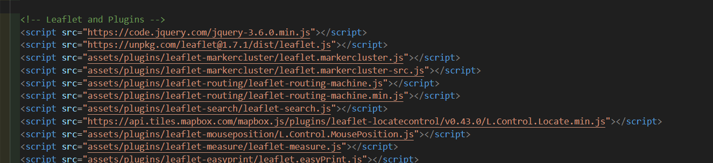
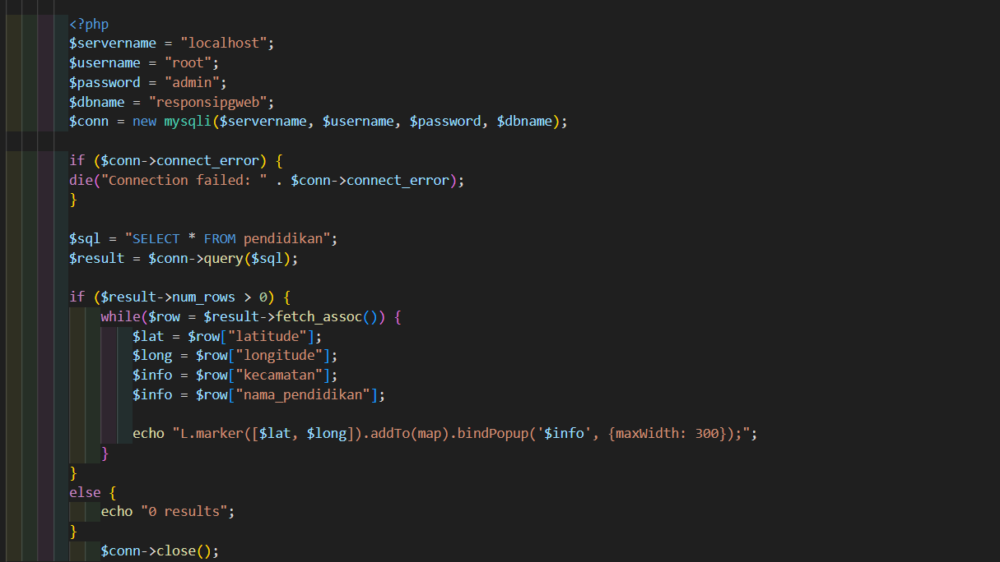

# pgweb-responsi
Nama: Joseph Damarseto 
NIM: 22/502852/SV/21451
Program Studi: Sistem Informasi Geografis

Deskripsi: 
SIPENJAKS merupakan peta WebGIS interaktif yang bertema tentang persebaran fasilitas pendidikan yang berada di wilayah Kota Administrasi Jakarta Selatan. SIPENJAKS berisi beberapa macam konten seperti konten website resmi Kota Jakarta Selatan, peta persebaran titik fasilitas pendidikan (SD, SMP, SMA) di Kota Administrasi Jakarta Selatan. SIPENJAKS juga memiliki informasi mengenai data penduduk dan data fasilitas pendidikan di Kota Administrasi Jakarta Selatan

Komponen: 
Geoserver untuk mengambil data dari QGIS
PHPMyAdmin sebagai database untuk menampilkan titik persebaran fasilitas pendidikan 
Bootstrap sebagai referensi pembuatan website
PHP, HTML, CSS sebagai komponen penyusun WebGIS
Leaflet sebagai library open source untuk menyusun WebGIS

Sumber Data:
BPS Fasilitas Pendidikan Kota Administrasi Jakarta Selatan Tahun 2020

Tangkapan Layar Komponen:

